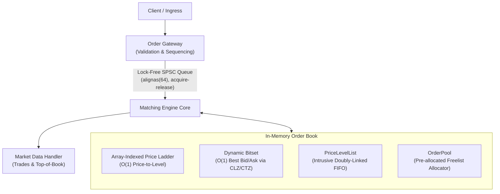

# Low-Latency Limit Order Book & Matching Engine

A deterministic, high-throughput limit order book (LOB) matching engine in C++20. Designed with mechanical sympathy: cache-line alignment, zero heap allocations on the hot path, O(1) price-level operations, and lock-free thread boundaries.



---

## Core Design

- **Zero-Allocation Hot Path:** Pre-allocated `OrderPool` with an intrusive freelist allocator completely avoids dynamic memory allocations (`new`/`delete`/`malloc`) during order processing.
- **O(1) Level Indexing:** Direct array-indexed `PriceLadder` discretizes prices into ticks, providing constant-time access to price levels without tree traversals.
- **O(1) Top-of-Book Discovery:** Word-level `DynamicBitset` tracks level occupancy, locating best bid and ask in constant time using CPU bit-scanning intrinsics (`__builtin_clzll` and `__builtin_ctzll`).
- **O(1) FIFO & Cancellation:** Price levels use intrusive doubly-linked lists embedded inside `Order` structs, allowing $O(1)$ removals on cancellation without node lookup or allocations.
- **Lock-Free Pipeline:** Cache-line aligned (`alignas(64)`) SPSC ring buffer synchronizes ingress and matching threads with acquire-release memory semantics to prevent false sharing.
- **Differential Verification:** Randomized fuzz testing against a naive `std::map` reference engine verifies invariant preservation, trades, and execution reports.

---

## Performance & Benchmarks

Benchmarked on Linux (x86_64, `-O3 -march=native`):

### Latency Percentiles (HDR Histogram)

| Metric | Latency |
| :--- | :--- |
| **p50 (Median)** | **139.7 ns** |
| **p90** | **270.5 ns** |
| **p99** | **448.8 ns** |
| **p99.9** | **1,011.9 ns** |
| **Mean** | **170.4 ns** |

### Throughput

| Component | Metric | Result |
| :--- | :--- | :--- |
| **Matching Engine Batch** | Order Throughput | **1.47M orders/sec** |
| **Order Cancellation** | Operation Throughput | **380.8M ops/sec** |
| **Memory Pool Alloc / Dealloc** | Allocation Latency | **0.25 ns / op** (3.96T ops/sec) |
| **SPSC Queue Concurrent** | Inter-thread Transfer | **232.6M items/sec** |

---

## Build & Test

### Quick Start (via `build.sh`)
```bash
# Build core library, test suite, and benchmarks
./build.sh

# Run all 65 unit and differential fuzz tests
./build/matching_tests

# Run latency and throughput benchmarks
./build/matching_bench
```

### CMake
```bash
mkdir -p build && cd build
cmake .. -DCMAKE_BUILD_TYPE=Release
make -j$(nproc)

./matching_tests
./matching_bench
```

---

## Repository Layout

```
.
├── include/matching/       # Public headers (matching_engine, price_ladder, order_pool, spsc_queue)
├── src/                    # Core engine, price ladder, memory pool, and queue implementations
├── tests/                  # Unit tests, integration tests, and differential fuzzing harness
├── benchmarks/             # Latency histogram and throughput benchmarks
├── CMakeLists.txt          # CMake configuration (supports ASAN/TSAN targets)
├── build.sh                # Direct compiler build script
└── README.md
```
